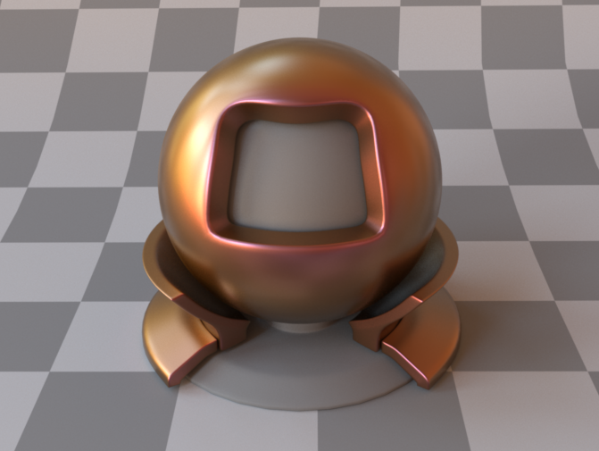
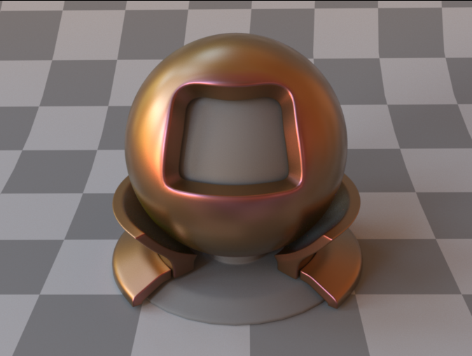
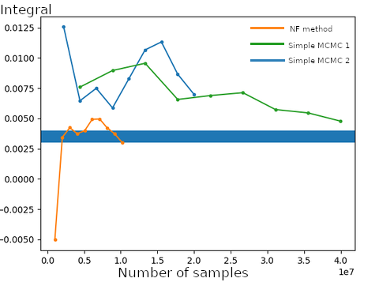
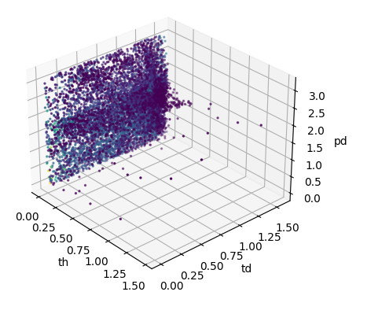
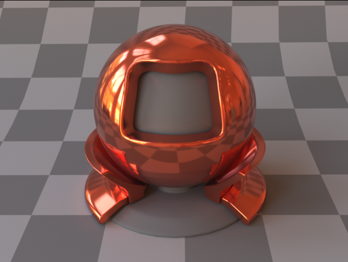
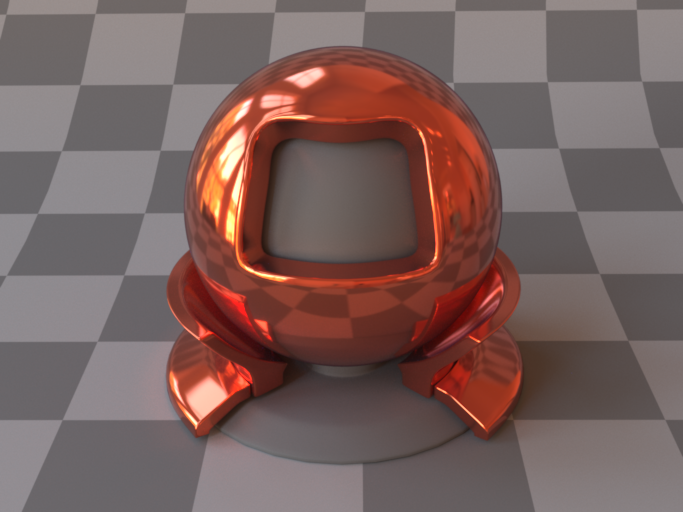

# MCMC Reflectometry
#### Introduction
This project is my master's thesis. It discovers the possibility of acquiring real life material's BRDF adaptively, using Markov chain Monte Carlo. 

Like doing importance sampling Monte Carlo in rendering, during material acquisition, we can focus measurements on the part of a real BRDF where its value is high. This will make the acquisition
process faster, while still providing sufficient information for rendering.

The idea is that Markov chain Monte Carlo theoretically guarantees that we can importance sampling from any distribution as long as we can evaluate the unnormalized version of that distribution. In terms of BRDF, it means being able to evaluate the cosine-weighted BRDF, which is exactly what we want. it will importance sample the real life BRDF and provide us with good samples to use in rendering real-life material.

#### Approaches

The project can be divided into three parts:

##### Acquisition

- Use a good MCMC proposal to acquire high quality BRDF samples. The proposal is the most important thing since it will make MCMC converge faster, thus providing us with better results.
- Ideally, we want to let the proposal change adaptively to fit the BRDF.

##### Post-acquisition interpolation:

 - Because samples from MCMC are not structured, and sparse, a way to interpolate samples is needed so that we can evaluate any $BRDF(\omega_i,\omega_o)$. Once we have the interpolation method, we can use the acquired BRDF in any rendering software.

##### Rendering 

- To render the image using the acquired BRDF, we also need to generate a pdf for importance sampling in renderer.

#### Details

- We have explored several proposals and their respective interpolation method.
  - Proposals:
    - Spherical Gaussian
    - a GGX VNDF(visible normal distribution function) as the guidance for importance sampling
    - Primary sample space MCMC which samples $\theta_h,\theta_d,\phi_d$ uniformly
    - Primary sample space MCMC which uses normalizing flows(a kind of neural network that is able to represent any arbitrary pdf) to importance sample $\theta_h,\theta_d,\phi_d$. The flows can be trained during acquisition using the distribution of those already acquired samples.
  - Interpolation
    - For the first three method, the only way to do is to perform a Delaunay triangulation on the samples and interpolate the unknown location. The area outside of triangulation is filled by solving a Poisson's equation.
    - For normalizing flows, a post-acquisition optimization to minimize the error between flows pdf and the ground truth BRDF is performed. And the unknown locations could be expressed using this optimized.
  - PDF for importance sampling in renderer
    - For non-normalizing flows method. A GGX roughness $\alpha$ is fitted using all acquired samples and the VNDF of this analytic GGX is used as importance sampling pdf
    - For normalizing flows, since it is a pdf itself, we directly use the pdf.

#### Results

- Both the non-adaptive GGX-VNDF, PSS MCMC and the adaptive MCMC method are able to express rough materials well. From top to bottom are rendered images of ground truth, VNDF and PSS-normalizing flows

  

  

  

 - The only adaptive method is the normalizing flows. The normalizing flows shows a better convergence in BRDF integration test and a higher & growing acceptance rate during acquisition experiment. It also generate desired sample distribution.

   

   

   - For glossy material, none of the methods does well. Because of the lack of a good pdf and interpolation method, all non-adaptive have large amount of noises. The normalizing flows perform better in this case. The first image is ground truth and the second image is the normalizing flow BRDF.

     

​		

#### Problems

There are still two problems for the normalizing flows method:

1. Instability:
   - the optimization and sample generation processes are random, there is a not-low possibility that the optimization will fail and thus we can not use the failed normalizing flows to express BRDF. Also, the normalizing flows is only a pdf. 
   - we need to simultaneously compute a constant $c$ during post-acquisition optimization so that we can express the BRDF as $pdf * c$, which makes the optimization more unstable.
   - Some low BRDF samples(in our experiment, $10\%$ of the samples) are still needed to 'regulate' the optimization behavior of the part where BRDF is low. Without those samples, the optimization at that part generally fails.
2. Inaccuracy: For success cases, we have noticeable inaccurate(darker) ring at the edge of the sphere, which means the BRDF at grazing angles is not accurate. Although there are more samples at grazing angles since the BRDF is generally larger there and the MCMC can successfully capture it, we still can not get an accurate result.

Future work to express real-life material BRDF using normalizing flows may need to solve these issues.
